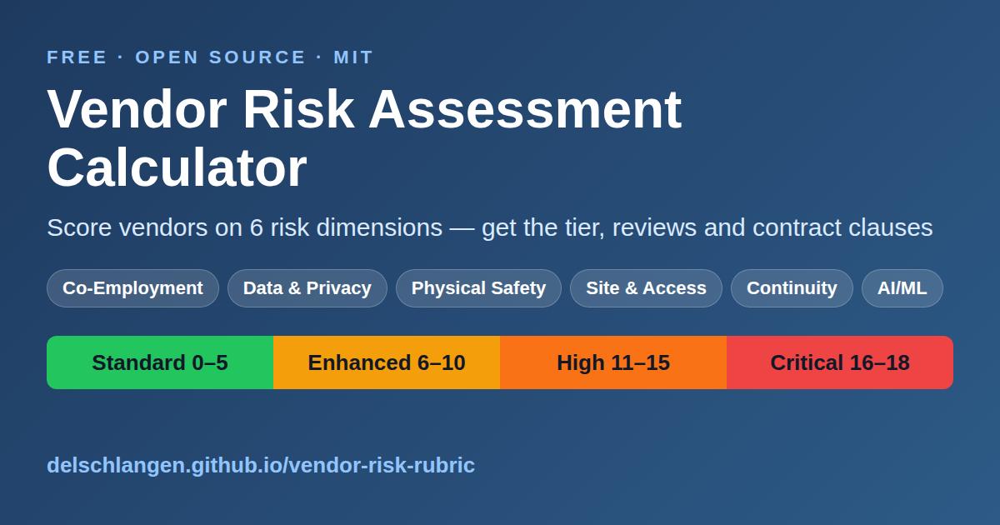

# Vendor Risk Assessment Framework

*Third-party risk management (TPRM) · supplier due diligence · vendor onboarding · contract risk · AI vendor governance*

[](https://delschlangen.github.io/vendor-risk-rubric/)
[](LICENSE)
[](https://delschlangen.github.io/vendor-risk-rubric/)
[](CHANGELOG.md)
[](CITATION.cff)

**A complete, practical framework for third-party vendor risk management, supplier due diligence, and contract governance.**

Assess vendors across six risk dimensions — co-employment, data sensitivity, physical safety, site access, business continuity, and AI/ML risk — with a scored rubric that determines review pathways and required contract protections. Aligned with the NIST Cybersecurity Framework, ISO/IEC 27001, the NIST AI Risk Management Framework, and regulatory requirements including GDPR, HIPAA, CCPA, SOX, and the EU AI Act.

> **[Use the interactive calculator →](https://delschlangen.github.io/vendor-risk-rubric/)** — No installation required. Score vendors directly in your browser.

[](https://delschlangen.github.io/vendor-risk-rubric/)

---

## What's new in v1.1.0 (2026-09-15)

- The calculator now records vendor details and per-dimension justifications, exports Markdown/JSON, supports shareable links, example presets, and conditional reviews and clause triggers aligned to the decision tree.
- Documentation hub, SEO/social metadata, favicon, sitemap, and 404 page for the live site.
- Community files: [CONTRIBUTING](CONTRIBUTING.md), [SECURITY](SECURITY.md), [Code of Conduct](CODE_OF_CONDUCT.md), issue forms, and a link checker (`scripts/check_links.py`).
- Regulatory refresh of the [jurisdiction guide](docs/jurisdiction_considerations.md), including a DORA section and a regulatory watch-list.
- Consistency fixes across the rubric, examples, and templates.

See [CHANGELOG.md](CHANGELOG.md) for the full history.

Status: actively maintained — last reviewed 2026-09-15.

---

## Why Use This?

| Without a framework | With this framework |
|---------------------|---------------------|
| Every vendor gets different scrutiny | Consistent, scored approach |
| Contract protections are missed | Tiered clause library matched to risk |
| Reviews take forever (or don't happen) | Clear workflows with timelines |
| AI/ML risks are overlooked | AI is a core risk dimension |
| Accountability is unclear | RACI matrix defines who does what |

**This framework is used by organizations that:**
- Engage 50+ vendors
- Handle sensitive or regulated data
- Use AI/ML services from vendors
- Want a defensible, documented process

---

## Quick Start

### For a new vendor:

1. **Gather information** — Have the requestor complete the [intake questionnaire](templates/intake_questionnaire.md)
2. **Score the vendor** — Use the [risk rubric](rubric/risk_rubric.md) or [quick reference card](docs/quick_reference.md)
3. **Determine review pathway** — Follow the [decision tree](rubric/decision_tree.md)
4. **Select contract clauses** — Pick from the [clause library](clauses/contract_clauses.md)
5. **Document the assessment** — Use the [blank assessment template](templates/blank_assessment.md)

### Using the calculator

The [interactive calculator](https://delschlangen.github.io/vendor-risk-rubric/) mirrors the rubric and decision tree:

- **Share links** — Every assessment encodes into the URL; use *Copy link* to share a scored assessment with reviewers or attach it to a ticket. Drafts also autosave in your browser.
- **Example presets** — Load any of the four worked examples with one click to see how scoring plays out.
- **Export** — Download the finished assessment as Markdown (ticket-ready) or JSON for your records.

See the [Calculator Guide](docs/calculator_guide.md) for details.

### For leadership buy-in:

Share the [executive summary](docs/executive_summary.md) — a one-page overview of the framework and its benefits.

### To implement in your organization:

Follow the [adoption guide](docs/adoption_guide.md) — a phased rollout plan with common pitfalls to avoid.

---

## What's Included

### Core Framework

| Document | What It Does |
|----------|--------------|
| [Risk Rubric](rubric/risk_rubric.md) | 6-dimension scoring criteria (0–3 each) |
| [Decision Tree](rubric/decision_tree.md) | Workflow for routing vendors to review tracks |
| [Contract Clauses](clauses/contract_clauses.md) | Tiered contract language library |

### Templates

| Document | What It Does |
|----------|--------------|
| [Blank Assessment](templates/blank_assessment.md) | Fillable assessment form |
| [Intake Questionnaire](templates/intake_questionnaire.md) | Form to gather info from requestors |

### Guides & Reference

| Document | What It Does |
|----------|--------------|
| [Quick Reference](docs/quick_reference.md) | One-page scoring cheat sheet |
| [Calculator Guide](docs/calculator_guide.md) | How to use the interactive calculator and its exports |
| [Adoption Guide](docs/adoption_guide.md) | How to implement the framework |
| [RACI Matrix](docs/raci_matrix.md) | Who is responsible for what |
| [Jurisdiction Guide](docs/jurisdiction_considerations.md) | EU AI Act, GDPR, CCPA/CPRA, HIPAA, SOX, GLBA, DORA |
| [Executive Summary](docs/executive_summary.md) | Leadership-level overview |
| [FAQ](docs/faq.md) | Common questions answered |

### Examples

| Vendor Type | Key Risks Illustrated |
|-------------|----------------------|
| [AI Analytics Vendor](examples/filled_example.md) | Data sensitivity + AI/ML risk |
| [Staffing Agency](examples/staffing_agency.md) | Co-employment + security access |
| [Low-Risk SaaS](examples/low_risk_saas.md) | Standard tier flow |
| [Construction Vendor](examples/construction_vendor.md) | Physical safety escalation |

---

## The Risk Dimensions

| # | Dimension | What It Measures |
|---|-----------|-----------------|
| 1 | **Co-Employment** | Could vendor workers be classified as our employees? |
| 2 | **Data Sensitivity** | What sensitive/regulated data do they access? |
| 3 | **Physical Safety** | Are there injury risks from their work? |
| 4 | **Site & Security Access** | Do they have facility or system access? |
| 5 | **Business Continuity** | What if they fail or we need to switch? |
| 6 | **AI/ML Risk** | Are AI/ML systems involved? Training on our data? |

---

## Risk Tiers

| Total Score | Tier | Review Level | Timeline |
|-------------|------|--------------|----------|
| 0–5 | **Standard** | Procurement only | 1–2 weeks |
| 6–10 | **Enhanced** | + Security + Legal | 3–6 weeks |
| 11–15 | **High** | + Exec sponsor + Full assessment | 6–12 weeks |
| 16–18 | **Critical** | + C-suite + Board notification | 6–12 weeks |

**Escalation triggers:** Any single dimension = 3 requires the specialist review and the Enhanced clause set, even if the total score is low; the tier itself is set by the total.

---

## Project Structure

```
vendor-risk-rubric/
├── rubric/
│   ├── risk_rubric.md          # Scoring criteria
│   └── decision_tree.md        # Review workflows
├── clauses/
│   └── contract_clauses.md     # Tiered contract language
├── templates/
│   ├── blank_assessment.md     # Fillable assessment
│   └── intake_questionnaire.md # Information gathering form
├── examples/
│   ├── filled_example.md       # AI vendor (Enhanced tier)
│   ├── staffing_agency.md      # Contractor (High tier)
│   ├── low_risk_saas.md        # Simple SaaS (Standard tier)
│   └── construction_vendor.md  # Physical work (Enhanced tier)
├── docs/                       # GitHub Pages site + guides
│   ├── index.html              # Interactive risk calculator
│   ├── app.js                  # Calculator logic
│   ├── styles.css              # Calculator styles
│   ├── 404.html                # Not-found page for the live site
│   ├── sitemap.xml             # Search engine sitemap
│   ├── robots.txt              # Crawler directives
│   ├── favicon.svg             # Site icon (SVG)
│   ├── favicon-32.png          # Site icon (32×32 PNG)
│   ├── apple-touch-icon.png    # iOS home-screen icon (180×180)
│   ├── og-image.png            # Social sharing image (1200×630)
│   ├── calculator_guide.md     # How to use the calculator
│   ├── quick_reference.md      # One-page cheat sheet
│   ├── adoption_guide.md       # Implementation guide
│   ├── raci_matrix.md          # Role accountability
│   ├── jurisdiction_considerations.md  # Regulatory requirements
│   ├── executive_summary.md    # Leadership overview
│   └── faq.md                  # Common questions
├── .github/
│   ├── ISSUE_TEMPLATE/         # Structured issue forms
│   │   ├── calculator_bug.yml
│   │   ├── content_correction.yml
│   │   ├── new_example.yml
│   │   ├── regulatory_update.yml
│   │   └── config.yml
│   └── PULL_REQUEST_TEMPLATE.md
├── scripts/
│   └── check_links.py          # Relative-link checker (stdlib only)
├── CHANGELOG.md                # Release history
├── CITATION.cff                # Citation metadata
├── CONTRIBUTING.md             # How to contribute
├── CODE_OF_CONDUCT.md          # Contributor Covenant 2.1
├── SECURITY.md                 # Security policy
├── README.md
└── LICENSE
```

---

## Customizing for Your Organization

1. **Adjust scoring thresholds** — The tier boundaries (0–5, 6–10, etc.) are starting points. Lower them for more conservative risk posture, raise them for faster processing.

2. **Add organization-specific indicators** — Each dimension lists "Key indicators." Add ones specific to your industry or operations.

3. **Customize contract clauses** — Have Legal review and adapt the clause language for your jurisdiction.

4. **Assign named owners** — Replace generic role names in the RACI and decision tree with actual people/teams.

5. **Add dimensions** — Need ESG or geographic risk? Add a seventh dimension following the same 0–3 scoring pattern.

---

## Framework Alignment

This framework aligns with:

- **NIST Cybersecurity Framework** — supply chain risk management ([NIST](https://www.nist.gov/cyberframework))
- **ISO/IEC 27001** — supplier relationship controls ([ISO](https://www.iso.org/standard/27001))
- **NIST AI Risk Management Framework** — AI supply chain considerations ([NIST](https://www.nist.gov/itl/ai-risk-management-framework))
- **Common regulatory expectations** — GDPR, HIPAA, CCPA/CPRA, SOX, GLBA, EU AI Act, DORA vendor-oversight requirements

---

## Contributing

Contributions are welcome — see [CONTRIBUTING.md](CONTRIBUTING.md) for how to propose examples, clauses, corrections, and regulatory updates, and note the [Code of Conduct](CODE_OF_CONDUCT.md) and [security policy](SECURITY.md).

Use the structured issue forms to get started: [Report a calculator bug](https://github.com/delschlangen/vendor-risk-rubric/issues/new?template=calculator_bug.yml), [Content correction](https://github.com/delschlangen/vendor-risk-rubric/issues/new?template=content_correction.yml), [Propose an example](https://github.com/delschlangen/vendor-risk-rubric/issues/new?template=new_example.yml), or [Regulatory update](https://github.com/delschlangen/vendor-risk-rubric/issues/new?template=regulatory_update.yml).

---

## Live Demo

Use the interactive risk calculator directly in your browser:

**https://delschlangen.github.io/vendor-risk-rubric/**

No installation or dependencies required. Score vendors, see required reviews, and get contract clause recommendations instantly.

---

## License & Citation

This project is licensed under the **MIT License** — see [LICENSE](LICENSE) for details.

If you use this framework in your work, please cite it:

```
Schlangen, D. (2026). Vendor Risk Assessment Framework (Version 1.1.0) [Computer software]. https://github.com/delschlangen/vendor-risk-rubric
```

BibTeX:

```bibtex
@software{schlangen_vendor_risk_2026,
  author  = {Schlangen, Del},
  title   = {Vendor Risk Assessment Framework},
  version = {1.1.0},
  year    = {2026},
  month   = {9},
  url     = {https://github.com/delschlangen/vendor-risk-rubric}
}
```

See [CITATION.cff](CITATION.cff) for machine-readable citation metadata.

---

*Built by [Del Schlangen](https://linkedin.com/in/del-s-759557175/) • [ORCID](https://orcid.org/0009-0005-5116-9564)*
